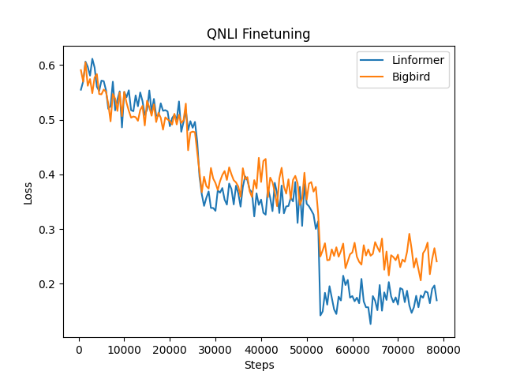

# coding-template

## Summary

The summary can contain but is not limited to:

- Code structure.

- Commands to reproduce your experiments.

- Write-up of your findings and conclusions.

- Ipython notebooks can be organized in `notebooks`.

We explored the Longformer, Linformer, Bigbird, and Performer architectures on the IMDB, SST2, QNLI, and QQP datasets.

## Reference

We used the following code references from huggingface and other sources to train and use pretrained models:

https://huggingface.co/transformers/v2.5.0/examples.html

https://github.com/huggingface/transformers/blob/v4.6.0-release/examples/pytorch/text-classification/run_glue.py

https://huggingface.co/google/bigbird-roberta-base

https://huggingface.co/allenai/longformer-base-4096

https://pythonrepo.com/repo/lucidrains-performer-pytorch-python-pytorch-utilities

https://pypi.org/project/linformer-pytorch/

## IMDB

### Hardware

All experiments on the IMDB dataset were performed on a laptop with an Intel(R) Core(TM) i7-10870H processor. The machine had 16 GB of RAM and used an NVIDIA Geforce RTX 3070.

### Model and Dataset

We experimented on the IMDB dataset. This dataset labeled the sentiment of sentences as either positive or negative from 50K movie reviews. The following models performed inference on this dataset:

* Bigbird
* Longformer

The following models were trained and evaluated on this dataset:

* Performer
* Linformer

### Code 

We had the Bigbird model, the Longformer model, Performer model, and Linformer model classify the movie reviews. The Bigbird and Longformer model were imported from the *Huggingface* transformers python package and used scripts provided by that package. Attempting to train these Huggingface models resulted in CUDA out-of-memory errors on my machine, so we only performed inference on the IMDB dataset for these models without fine-tuning. The Performer model can be found in IMDB/performer_model.py and was copied from https://github.com/lucidrains/performer-pytorch with a slight modification to perform binary classification of text. The Linformer model can be found in IMDB/linformer_lm.py and was copied from https://github.com/lucidrains/linformer with a slight modification to allow binary classification of text.

### Experiments

The Linformer and Performer models were trained with a batch size of 128 and a learning rate 1e-4 with varying depth sizes of 1, 2, and 3. To ensure that training was completed in a reasonable time, the training set was reduced to 10000 reviews and the validation set to 5000 reviews. The random seed was set to 0 before the data was sampled to ensure that every model received the same reviews in the training and validation sets. A tokenizer from the *Huggingface* transformers module was used for both models, meaning that both models used a vocabulary size of 50272 and a max sequence length of 4096. An embedding size of 64 was used with 4 heads for each model. All other model parameters used the defaults specified in the model files. The models were trained for 10 epochs with evaluations on the validation set occuring after every training loop. The total time it took for the models to perform all training and validation was recorded.

Inference for the Bigbird and Longformer models occurred over all 25K reviews in the validation data set. Both models were pretrained and used tokenizers optimized for their performance.

### Performance


Here we can see the Performer model took longer to train than the Linformer model at every depth level (2010, 3004, and 3990 seconds for the Performer model at depths of 1, 2, and 3 as opposed to 1481, 1909, 2428 seconds for the Linformer model at depths of 1, 2, and 3). Furthermore, the magnitude of increase when the depth level increases is higher for the Performer model than the Linformer model (the total training time increases by approximately 1000 seconds for the Performer model when the depth level increases by 1 while the total training time for the Linformer model increases by approximately 500 seconds).


We can also see that the Linformer models outperformed the Performer models at all depth levels. Furthermore, it appears that the models with higher depth sizes were outperformed by models with lower depth sizes. I am unsure why this occurred. It is clear that this is not due to overfitting since the models with lower depth sizes perform better on the training set as well as the validation set. Furthermore, it doesn't seem likely that this result was a product of the short training time as the Linformer model was able to achieve above 95% accuracy on the training set for depth sizes of 1 and 2. However, it is possible that this occurred due to poor hyperparameter selection. Due to time constraints, it was not possible to perform a thorough hyperparameter search, so larger depth sizes may have required different hyperparameters such as a more aggressive learning rate or a larger embedding size. Regardless, it is likely that the models would have had better performance if allowed to train on the entire dataset. As mentioned previously, the models only trained on 1/5 of the training samples available in the IMDB dataset due to time constraints. Training on all 25K would have allowed for the models to generalize better and learn more patterns.


The inference times for the Bigbird and Longformer models are shown above. The Bigbird model took 422 seconds to completely evaluate all reviews while the Longformer model took 2070 seconds. The Bigbird model however achieved an accuracy of 0.46 while the Longformer model achieved an accuracy of 0.5.

### Conclusion

In a comparison between the Performer and Linformer model, it appears that the Linformer model outperformed the Performer model in both accuracy and time on the IMDB dataset. Furthermore, it appears that lower depth sizes took less time and had better results. It is important to note that a thorough hyperparameter search did not occur for either model, so there could be hyperparameter combinations where the Performer model outperforms the Linformer model and where higher depth sizes outperform lower depth sizes.

When it comes to inference, it appears that the Bigbird model is superior to the Longformer model in speed. However, the Longformer did outperform the Bigbird in accuracy. Note that no fine-tuning occurred, however, so we cannot determine which model would have higher classification accuracy after they are trained.

## SST2

### Model and Dataset

We explored the SST2 dataset (Stanfored Sentiment Treebank). This is a binary sentiment analysis classification task that contains phrases with fine-grained sentiment labels in parse trees from movie reviews. It is similar to the previous SST1 dataset, but has neutral reviews removed. Some of the leading scores on this datset include XLNet-Large (96.8%), MT-DNN-ensemble (96.5%), and Snorkel MeTaL (96.2%). 

I explored using the following models on the dataset:

* Bigbird
* Longformer
* Performer
* Linformer

I was able to fine-tune Bigbird and Longformer for the task, but do to resource and time constraints, I was unable to fine-tune Performer or Linformer.

### Code

The code exists in the sst2.ipynb notebook file. I tried two approaches to fine-tune the models. For the models that had cards in huggingface (Bigbird and Longformer), I was able to pull the ptretrained model and tokenizer from online. For the other two models, I used the imported libraries to define and instantiate the models. I attempted to created a Trainer object and train and evaluate on the data. However, this led to issues with memory in Google colab. To overcome this, I used the run_glue.py script provided by huggingface to train their models. Since SST2 is a part of the GLUE benchmark, I was able to train and evaluate on it using this script. This script takes in the model name, task name, whether to train and evaluate, and values such as the learning rate, batch size, and number of epochs as parameters. I had set the batch size to 32, learning rate to 2e-5, and number of epochs to 3. Unfortunately, due to limited compute resources through colab, I was unable to experiment with different variations of the batch size, learning rate, or number of epochs. 

### Performance

### Bigbird

*** train metrics ***

Runtime - 48:27 \
Loss - 0.1315

*** eval metrics ***

Runtime - 4.59 seconds \
Accuracy - 95.41%

### Longformer

*** train metrics ***

Runtime - 42:36 \
Loss - 0.1286

*** eval metrics ***

Runtime - 4.25 seconds \
Accuracy - 96.18%

### Performer

*** eval metrics ***

Runtime - 4.45 seconds \
Accuracy - 52%

### Linformer

*** eval metrics ***

Runtime - 4.56 seconds \
Accuracy - 51%

### Analysis

As mentioned above, I was only able to iterate over one set of parameters for training and was unable to fine-tune Performer and Linformer. As this was a binary classification task (either positive or negative sentiment), a model that predicts one class for every input would have an accuracy of around 50% for an evenly distributed dataset. When examining the output from the Performer and Linformer models following softmax, the probability over both classes were hovering around 50%. I often saw an output of [.49, .51]. To me, this meant that the models were unsure over every evaluation input and that the pretrained model performed no better than than a default model that predicted the same class on any input. However, the evaluation runtime was comparable to the other models that were fine-tuned to the task.

When looking at the other two models (Bigbird and Longformer), I was able to successfully train them using the provided script from huggingface. The training times were comparable for fine-tuning and were not too expensive when training on Google Colab Pro using a GPU. They were able to train in under an hour. I first tried using the models in a similar fashion to Performer and Linformer, without fine-tuning, and also recieved accuracies around 50%. This shows me that the values I received for Performer and Linformer were not abnormal. However, after fine-tuning, I received very good results of 95% and above for both Bigbird and Longformer. Longformer performed slightly better at 96.18%, but I am interested in seeing how these differences would change based on experiments on the hyperparameters, namely learning rate. I am unable to provide a suggestion over these two models for this task as both models were designed to perform better on documents of greater length. The examples that I examined in the SST2 dataset were relatively short in length, sometimes being less than a complete sentence. 

## QNLI

### Model and Dataset

We conducted the following experiments on QNLI dataset.

The following models were trained and evaluated on the dataset:

- Longformer
- Linformer

### Installation

Note that Linformer model is only supported by specific branch of Hugging Face's transformers library.

The version can be install by the following commands:

```
pip install git+https://github.com/NielsRogge/transformers.git@modeling_linformer
```

The rest dependencies are the same as we mentioned before


### Hardware

All training are performed on a Linux machine with GTX3070 GPU.


### Code

The experiments can be reproduced by running the script `./qnli/run_glue.py`  by the following commands:

1. Big bird

```
python run_glue.py \
  --model_name_or_path google/bigbird-roberta-base \
  --task_name qnli \
  --do_train \
  --do_eval \
  --max_seq_length 128 \
  --per_device_train_batch_size 4 \
  --learning_rate 2e-5 \
  --num_train_epochs 3 \
  --output_dir ../exp/qnli_longformer/
```

2. Linformer

```
python run_glue.py \
  --model_name_or_path linformer \
  --task_name qnli \
  --do_train \
  --do_eval \
  --max_seq_length 128 \
  --per_device_train_batch_size 4 \
  --learning_rate 2e-5 \
  --num_train_epochs 3 \
  --output_dir ../exp/qnli_linformer/
```


### Experimental results

We train all models within `3` epochs within fixed learning rate `2e-5`.

The results are presented in the following tables.


**Big bird - eval metrics**

| Metrics            |            |
| ------------------ | ---------- |
| Accuracy           | 0.9103     |
| Runtime            | 0:00:18.10 |
| Samples            | 5463       |
| Samples per second | 301.797    |


**Linformer - eval metrics**

| Metrics            |            |
| ------------------ | ---------- |
| Accuracy           | 0.9079     |
| Runtime            | 0:00:08.31 |
| Samples            | 5463       |
| Samples per second | 657.27     |


As shown in the table, 





## QQP
