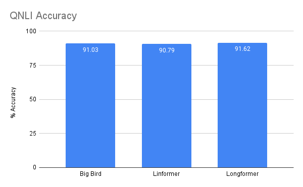
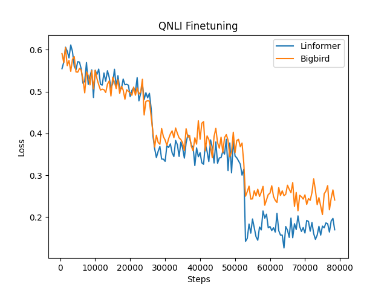

## QNLI

### Model and Dataset

We explored the QNLI (Stanford Question Answering) dataset. The dataset
consists of question-paragraph pairs where one of the sentences in the
paragraph (drawn from wikipedia) contains the answer to the corresponding
question. The task is converted to into sentence pair classification by forming
a pair between each question and each sentence in the corresponding text, and
filtering out pairs with low lexical overlap. The task is to determine whether
the sentence contains the answer to the question.

The following models were trained and evaluated on the dataset:

- Big bird
- Linformer
- Longformer

### Installation

Note that Linformer model is only supported by specific branch of Hugging Face's transformers library.

The version can be install by the following commands:

```
pip install git+https://github.com/NielsRogge/transformers.git@modeling_linformer
```

The rest dependencies are the same as we mentioned before


### Hardware

All training are performed on a Linux machine with GTX3070 GPU.
Longformer was trained on Google Colab Pro+.


### Code

The experiments can be reproduced by running the script `./qnli/run_glue.py`  by the following commands:

1. Big bird

```
python run_glue.py \
  --model_name_or_path google/bigbird-roberta-base \
  --task_name qnli \
  --do_train \
  --do_eval \
  --max_seq_length 128 \
  --per_device_train_batch_size 4 \
  --learning_rate 2e-5 \
  --num_train_epochs 3 \
  --output_dir ../exp/qnli_longformer/
```

2. Linformer

```
python run_glue.py \
  --model_name_or_path linformer \
  --task_name qnli \
  --do_train \
  --do_eval \
  --max_seq_length 128 \
  --per_device_train_batch_size 4 \
  --learning_rate 2e-5 \
  --num_train_epochs 3 \
  --output_dir ../exp/qnli_linformer/
```

3. Longformer

```
!python run_glue.py \
  --model_name_or_path allenai/longformer-base-4096 \
  --task_name qnli \
  --do_train \
  --do_eval \
  --max_seq_length 128 \
  --per_device_train_batch_size 64 \
  --learning_rate 2e-5 \
  --num_train_epochs 3 \
  --output_dir /tmp/qnli-longformer/ \
  --overwrite_output_dir \
  --gradient_checkpointing
```


### Experimental results

We train all models within `3` epochs within fixed learning rate `2e-5`.

The results are presented in the following tables.


**Big bird - eval metrics**

| Metrics            |            |
| ------------------ | ---------- |
| Accuracy           | 0.9103     |
| Runtime            | 0:00:18.10 |
| Samples            | 5463       |
| Samples per second | 301.797    |


**Linformer - eval metrics**

| Metrics            |            |
| ------------------ | ---------- |
| Accuracy           | 0.9079     |
| Runtime            | 0:00:08.31 |
| Samples            | 5463       |
| Samples per second | 657.27     |


As shown in the tables, Big bird model obtains a slight better result (i.e., 91.03% v.s. 90.79%) in accuracy. On the other hand, Linformer model is two times faster than the Big bird model. We believe it is because of the reduced complexity of Linformer model.


**Longformer - eval metrics**

| Metrics            |            |
| ------------------ | ---------- |
| Accuracy           | 0.9162     |
| Runtime            | 0:01:48.54 |
| Samples            | 5463       |
| Samples per second | 50.382     |


We also present the Longformer evaluation result in the table. As for performance, the Longformer obtain the best accuracy among all three methods, which shows the effectiveness of the ability of capturing long-term context. Note that the runtime is computed on very different hardware, thus it can not be compared with the aforementioned result.





Finally, we demonstrate the loss curve of Linformer model and Big bird model. According to the figure, Big bird model converged faster than the Linformer model. Thus, it also shows more slightly better accuracy  in the QA tasks.



